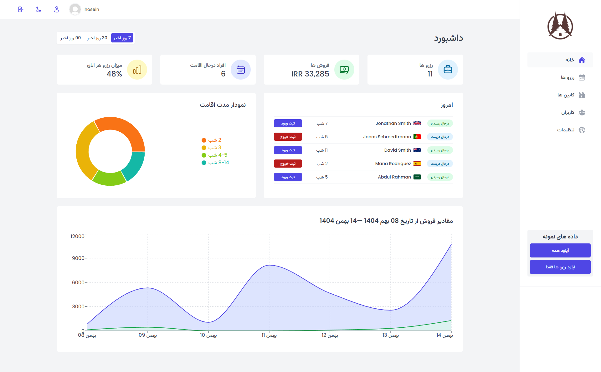
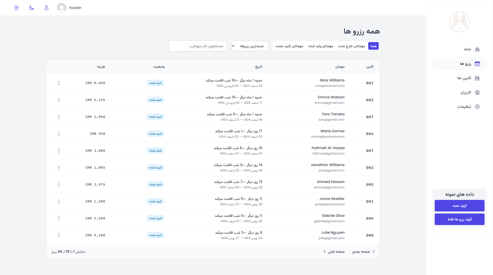
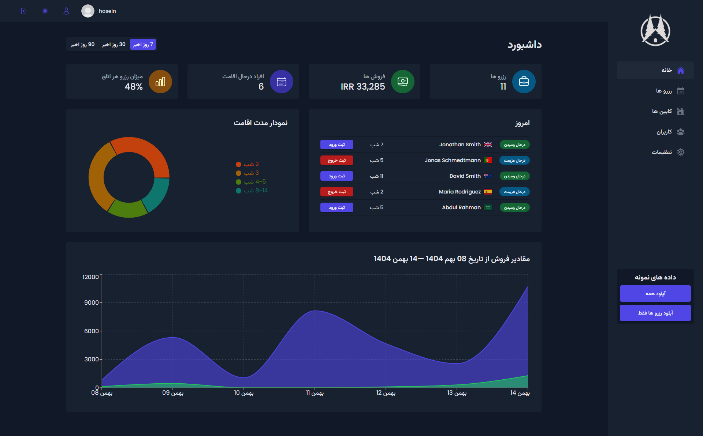

# Green Nest – Admin Booking Management Panel

Green Nest is a production-style admin dashboard designed for managing hotel or eco-lodge reservations.
The application is built exclusively for administrators to manage bookings, guest check-ins, and payment confirmations through a clean, scalable, and well-structured interface.

This project was developed as a real-world practice application with production-level architecture and best practices, and is intended to serve as a strong portfolio project.

---

## Live Demo

🔗 Live Application:  
<https://green-nest-rosy.vercel.app/>

>⚠️ attention : this is only for pc screen and devices with higher than 1300px width.

> ⚠️ This application is intended for admin use only.

---

## Demo Credentials (For Evaluation)

Use the following credentials to access the admin panel:

- user : <hosein@test.com>
- pass : 000000000

> These credentials are provided for demo and evaluation purposes only.

---

## Screenshots

<div>

### Bookings Dashboard



### Booking Details & Check-in Flow



### Dark Mode Support



</div>

---

## Key Features

- Admin authentication (login & internal signup)
- Email-based authentication via Supabase (phone support expandable)
- Booking management dashboard
- Detailed booking and guest information
- Guest check-in workflow with payment confirmation
- Light / Dark mode support
- Modular and scalable architecture
- Reusable UI components
- Deployed on Vercel

---

## Tech Stack

###### Frontend

- 
- 
- 
- 
- 
- 

###### State & Data Management

- ## 

###### Styling & UI

- 

- 
  - (used within styled-components)

###### Charts & Visualization

- [](https://recharts.org/)

###### Backend / Services

- [](https://supabase.com)

###### Utilities

- Jalali calendar package
- Custom formatting helpers (currency, dates, etc.)

###### Tooling

- [](https://eslint.org)
- [](https://prettier.io)

###### Deployment

- [](https://vercel.com)

---

## Project Structure

```txt
src/
├─ assets/ # Static assets
├─ context/ # Global contexts (Dark Mode logic & state)
├─ data/ # Static or mock data
├─ features/ # Feature-based modules (auth, bookings, check-in, etc.)
├─ hooks/ # Shared custom React hooks
├─ pages/ # Main application pages
├─ services/ # Database & API service layer (Supabase)
├─ styles/ # Global styles and theming setup
├─ ui/ # Reusable UI building blocks
├─ utils/ # Helper utilities (currency, calendar options, etc.)
└─ main.jsx # Application entry point
```
